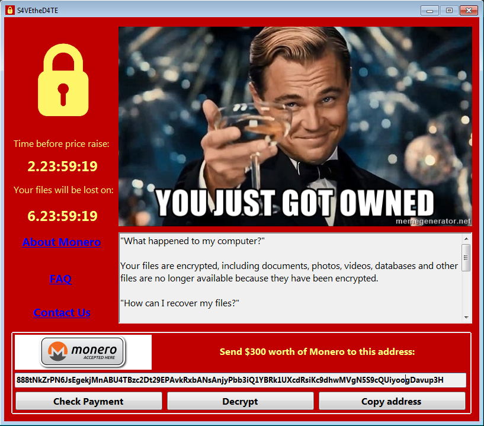

# S4VEtheD4TE
Ransomware written in C# using Windows Forms. Inspired by the famous WannaCry ransomware.

DISCLAIMER: I am not responsible for misuse of this software for illegal activities. Remember: with great power comes great responsability!

## Usage

The program will encrypt all files in the folder C:\encryption_tests. BE CAREFUL!

## TODO

 - Write countdown to registry
 - Check if user attempt to modify registry
 - Implement file deletion
 - Link to Monero homepage
 - Wallet address

## Screenshot

